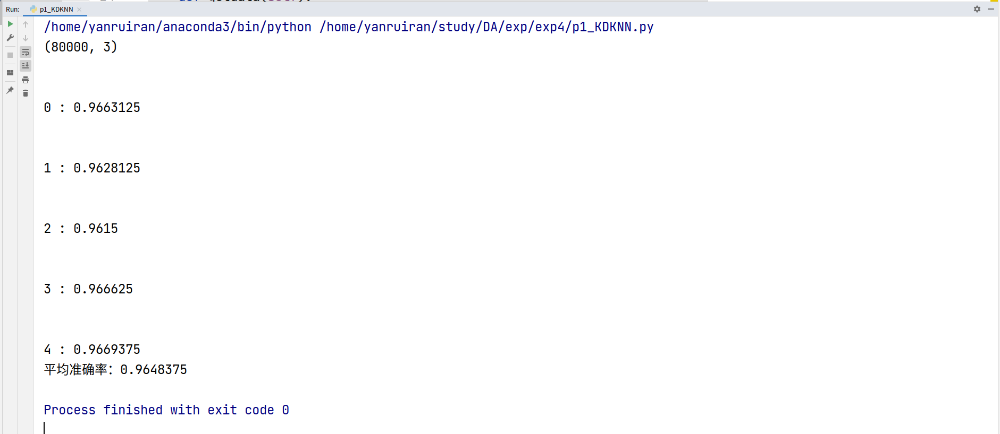
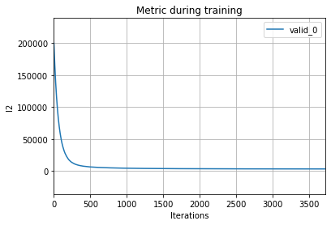
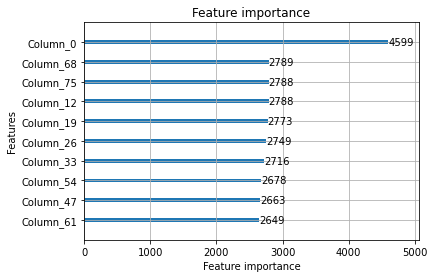

# 实验4

## part1:

### 实验内容：

手动实现一种分类算法（例如，决策树、 KNN或者朴素贝叶斯）。并参考实验三特征工程，测试算法在 LoL
数据集上的预测性能。

### 实验要求：

* 代码实现只允许使用 numpy、pandas库和 python内置库，不允许使用现有的机器学习库。
* 预测任务与实验三一致，以准确率作为评价指标。自行在 LoL数据集上划分训练集和验证集（4:1比例、交叉验
  证），汇报算法在验证集上的性能 。
* 实验报告需介绍实现算法的主要流程。

### 算法：

本次实验使用KNN算法，主要思路如下：

简单KNN算法：

* 计算已知类别数据集中的点与当测试点之间的距离
* 按距离递增次序排序
* 选取与当前点距离最小的k个点
* 统计前k个点所在的类别出现的频率
* 找到这k个点出现频率最高的类别作为当前点的预测分类

但实验中发现，由于该算法复杂度过高，无法在短期内实现，所以需要使用课上所讲的KD树优化算法，算法流程如下：

1. 构造KD树
   * 确定分割维度。在数据方差最大的维度进行分割。
   * 确定分割节点。选择该维度数据中值进行分割，分割成左右子空间。
   * 对左子空间和右子空间内的数据重复上述过程，直到空间中只包含一个数据点。
2. 搜索KD树
   * 先进行二叉查找，找到最下层节点，计算距离，记为最小距离。
   * 回溯，当待分类节点与父节点的距离比最小距离小时，递归搜索该节点另一个子节点。
   * 重复上述回溯过程直到回溯到根节点。
   * 返回记录距离最小值的节点。

### 注意事项：

* 要进行特征的归一化，不然均值很大的特征在计算过程中对距离影响就会相应变大从而影响均值较小的特征，这是很不合理的，所以进行KNN前要进行特征的归一化。
* 样本特征可能具有不均衡性，而KNN将特征视作均衡的(进行归一化后)，我们可以在真实训练中对数据加入权重，本实验直接将对影响权重小的特征去除，选取相关性大的特征进行训练(见程序说明)。

### 程序说明：

part1部分提交两份代码，分别为p1_KNN.py与p1_KDKNN.py文件。

p1_KNN.py通过暴力搜索进行KNN算法，代码中给出了简单的数据集可以运行出正确结果，而由于exp4中的数据集过大，程序运行时间会过长。经测试，只进行单次验证(4:1分配)运行时间大概在2小时左右，这显然是不行的，所以有了第二份KD树优化代码，下面也主要介绍该代码。

KDKNN程序开始时选择特征为：

```
['team1_firstBlood','team1_firstTower','team1_firstInhibitor'
     ,'team1_firstBaron','team1_firstDragon','team1_firstRiftHerald'
     ,'eco_gap','kills_gap']
```

其中，最后两个经济差，杀敌差特征为exp3中的组合特征。

该模型训练效果很不理想，后来发现是因为前几项特征与结果关联较小而归一化后却对结果有了相同的影响，而后两个特征与结果关联大却被前几项拉低了影响。所以，在之后的训练中直接用最后两个特征进行训练，最终得到了很好的效果。

### 结果：

最终平均准确率为：96.5%。



## part2:

### 实验内容：

利用所学的知识，进行一场数据科学实战。数据集仍然使用实验三的数据集，但预测任务有变。可以利用开源工具包，也可以参考实验三的数据分析与特征工程。

### 实验要求：

* 助教会发布数据集中一部分样本的标签，作为训练集，而另一部分样本作为测试集。
* 需要预测测试集中每个样本的比赛持续时间 gameDuration。
* 以均方误差 mean-square error作为评价指标。
* 可以提交两份预测结果。
* 预测结果用 csv格式保存。

### 算法：

本次主要使用LightGBM算法，其次，还对XGboost和随机森林算法进行了测试。这些都有不错的效果。同时也有失败的算法，开始时我想直接尝试用一些与游戏时间相关性较大的特征进行线性拟合，看能不能直接拟合出好的结果，结果失败了，但这也是一个很好的尝试，这个在后面的失败经历进行总结。

LightGBM有封装好的包lightgbm，本次实验直接使用该包进行调试；同时也有XGBoost的包xgboost；随机森林算法则使用sklearn中的RandomForestRegressor。这些都是数据科学比赛中常用的开源工具包，简单好用易上手。

### 实验过程记录：

#### 1. 数据清洗与特征工程

由于实验三与该实验四的预测目标不同，所以实验三中的特征工程很多都没有用，比如每个英雄的数据，这些对游戏时间影响基本没有，如果单独拿出来加入特征进行拟合会有过拟合的问题，所以重新进行了一些数据的清洗和特征工程，进行工作如下：

* **去除了seasonId与mapId：**因为seasonId在所有的数据中都是13，所以是没用的数据，而mapId由实验三得其能直接被queueId表示所以只需要保留queueId即可。实验三中去除了queueId是因为通过关联表发现queueId与胜负关系不大，但在估计游戏时间中，不同游戏模式显然对游戏时间有影响，故进行保留。
* **进行了经济特征与人头特征的组合：**对队伍总经济与队伍总人头进行了统计，这与实验三中的过程相同。使用这些组合特征的原因是因为想通过一些简单的线性拟合模型来直接进行拟合，后来发现这方法不太行。
* **种类特征进行编码：**通过sklearn模块中的LabelEncoder方法对种类特征进行编码。因为分类特征的值是没有意义的，有意义的是两个值是否相同，如queueId的数的大小没有意义，这就需要将其改变为编码类型。这一步也是整个特征工程花费时间最多的一步，因为要找到所有的分类特征，而这些分类特征不仅只有char类型还有Int类型所以很难处理。最后是直接找到了规律，将特征中所有带有‘Id’的特征看作分类特征即可。

#### 2. 数据切分与算法效果评估

由于实验只给了训练集而没有给测试集的标签来进行算法性能的评估，所以只能将训练集进行随机切分分为切分的训练集和验证集，再用均方误差评估算法好坏，最后再选择最好的算法来对整体数据集进行测试。

#### 3.算法测试

以上工作做完之后就要进行算法的选择，选择算法的方法就是将每种算法的基模型先进行预测，然后通过比较得到最好的基模型。在基模型上在进行参数调整，我选择了以下的模型：

* 直接线性拟合相关数据：通过sklearn的LinearRegression直接进行线性拟合。这种方法传入的特征需要精心选择，我直接将所有的类别特征去除然后将数字特征和组合特征进行训练，得到的结果却非常差，见失败总结。
* 用LightGBM拟合：通过lightgbm直接进行拟合，这种方法十分方便，因为lightgbm直接能传入类别特征，而不需要像线性拟合一样进行额外的特征清洗，并且保留了类别特征对结果的影响，效果显然会更好。而结果也是如此，其均方误差能降到5000以下，这在基模型中已经是无敌的存在了，而后我也是通过该种算法得到最终测试数据标签。
* 用xgboost进行拟合：xgboost是数据科学比赛中常用算法，其与lightgbm一样都是已经封装好的集成学习算法，通过不同的随机训练集切分验证得到其均方误差大概在6000~8000左右，略逊于lightgbm，但也是效果不错的算法。
* 用随机森林进行拟合：通过随机森林模型进行预测，由于随机森林不像上面两种基于集成学习的优化算法，所以拟合速度非常慢，但结果也不差，均方误差经多次测试大概在7000～9000左右。

算法对比图：

|              | **LightGBM** | **xgboost** | **随机森林** |
| :----------: | :----------: | :---------: | :----------: |
|   **速度**   |      快      |     中      |      慢      |
| **均方误差** |    <5000     |  6000~8000  |  7000~9000   |


#### 4.参数选取

由上我们使用效果最好的lightgbm模型，之后的工作就是进行具体的参数调节，因为上面只是进行了基模型的测试，还能通过参数调节得到更好的训练结果。经过多次调节，得到一组超参数如下：

```python
params = {
    'task': 'train',
    'boosting_type': 'gbdt',
    'objective': 'regression',
    'metric': 'mse',
    'max_depth': 15,
    'num_leaves': 20,
    'learning_rate': 0.01,
    'feature_fraction': 0.9,
    'bagging_fraction': 0.8,
    'bagging_freq': 5,
    'verbose': 0,
    'num_boost_round':8000,
    'early_stopping_rounds':10
}
```

其中    'feature_fraction' ，'bagging_fraction' ，'bagging_freq'三个参数是防止过拟合以及加快训练速度的，在保证训练次数足够的情况下，对结果影响不大。

主要影响因素是'max_depth','num_leaves', 'learning_rate'这几个参数，max_depth表示数的深度，num_leaves代表叶节点个数，而learning_rate是学习速率。

同时还有两个测试次数的相关参数num_boost_round与early_stopping_rounds，num_boost_round表示训练次数而early_stopping_rounds表示训练误差多少次回弹就结束，这里设置如上以避免不必要的冗余计算。

#### 5.可视化工作：

#### **可视化训练过程中评估指标下降趋势图：**

****

可以看出LGBM的误差下降速度非常非常的快，这也是该模型能如此盛行的重要原因。

#### **可视化重要度前10的参数：**

****

最重要的参数column_0通过查找原表可以发现其所代表的特征为queueId。这也非常好理解，不同游戏模式的游戏时间当然是应该不同的，与之前的特征过程的预测相同。如果在前面特征工程中删除这个特征后果不堪设想。接下来的这些特征是各个经济数据，这也很符合常理，游戏时间越长经济显然越高，所以也是重要信息。这些模型的重要度与设想基本相同，足以看出LGBM模型强大。

### **失败总结：**

1. 特征工程要由预测目标决定，实验三中的特征工程是做胜负预测，而实验四是要预测比赛时间。如果全盘使用实验三中的特征工程，例如将queueId去除，那就会有很多重要特征丢失以及多出来很多无用特征。所以，每个预测目标都对应自己相应的特征工程，不能因为省事而乱用，最多只能进行参考。

2. 特征工程中一定要将种类类型特征进行编码，编码方式可以使用onehot，在实验三中我也是这样做的，但有些强大的模型如LGBM本身是支持category类特征的，只需将它encode到int类型即可。

3. 包含大量种类特征的数据集不能只用简单的线性拟合模型。本实验中一开始用线性回归不仅花费了大量时间进行数据的特征组合而且其效果还很差，均方误差基本有10000以上。所以对于稍微复杂一点的模型不能仅仅使用简单模型，还应多考虑其他集成的复杂模型(LGBM，XGBoost等)，否则又耗时又费力，效果还差。

4. 不要进行无意义的轮子创造！自己的轮子效果又差又费时间，能直接通过开源工具完成的算法就用开源工具包，毕竟这些包中的算法都是经过无数次优化的而自己写的可能效率非常低。当然，这些算法的基本原理还是要有自己的基本理解的。


### 提交说明：

part2代码文件名是exp4_part2.ipynb，同时会提交两份预测结果，其都是由LGBM给出，不过参数的选取不同。主要的参数不同处在num_leaves，max_depth这两个参数，两次结果用两组不同num_leaves，max_depth得出。
