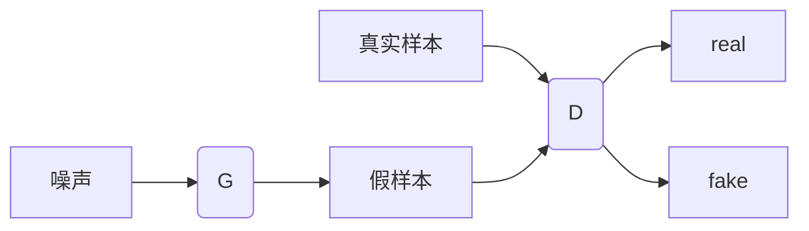
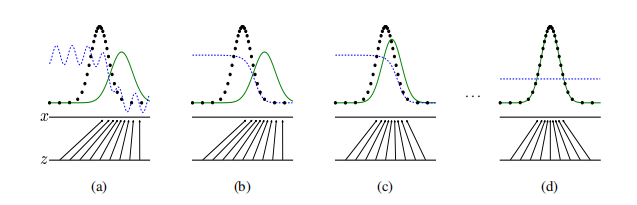
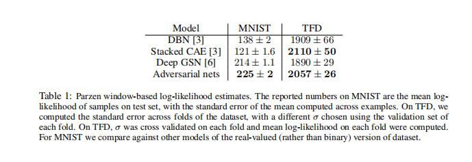
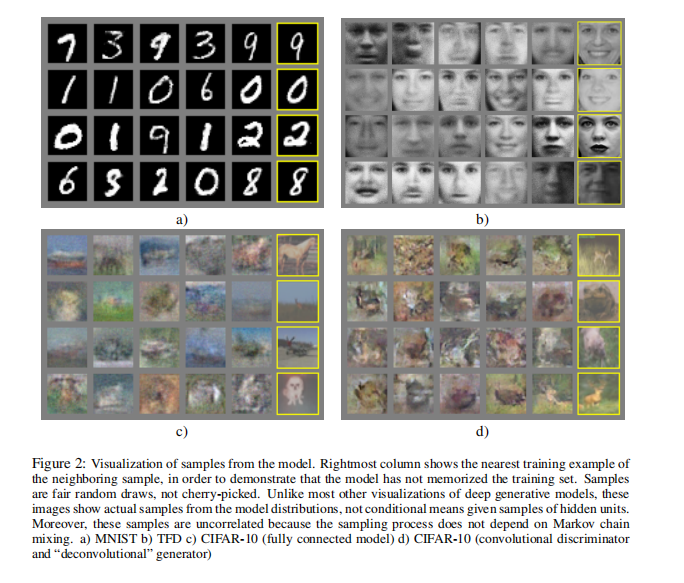
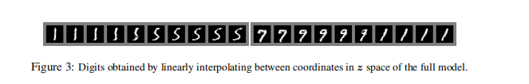
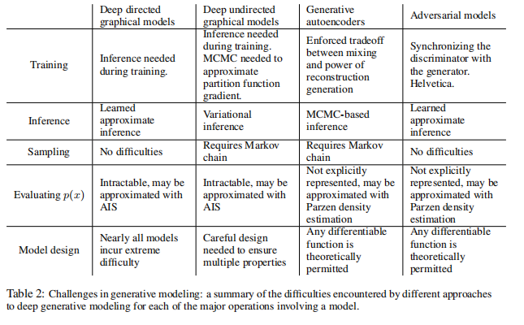
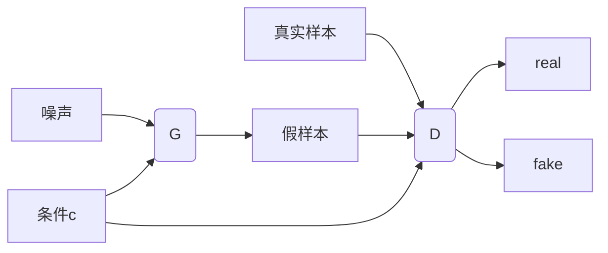
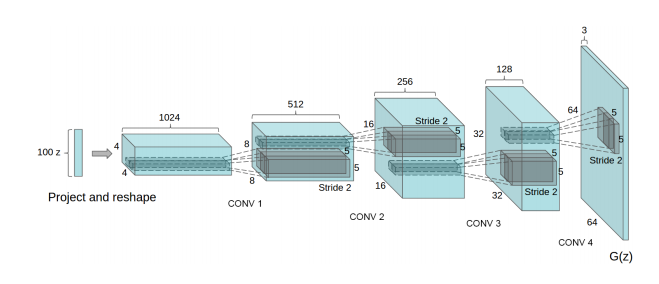
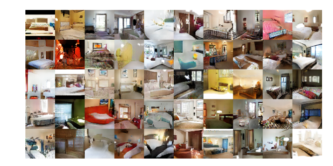

<div align='center' ><font size='70'>关于GAN的调研报告</font></div>

<div align='center' ><font size='4'>PB19000196 晏瑞然</font></div>

**摘	要：** 生成对抗网络(Generative Adversarial Nets, GAN)是当今数据分析领域重要模型之一，本次调研从第一篇提出GAN的论文Generative Adversarial Nets<sup>[1]</sup>出发，对GAN的结构、基本原理、算法、实验结果、模型优缺点等多方面进行了总结。最后还对GAN的衍生模型进行了简要介绍与分析。

**关键词：**深度学习；数据分析；GAN；DCGAN；CGAN；ACGAN；

## 引言

近年来，由于算力的提升，人工智能得到了火热发展，神经网络也成为该领域的研究热点，但大多数神经网络都是一种判别器模型，即从特征出发，通过网络判断对象的类别。而2014年，由Goodfellow等人提出的Generative Adersaril Nets(GAN)却可以实现一个生成器的功能，即通过对象生成对象，通过真样本生成假样本。这种强大的功能使得GAN瞬间成为数据分析与人工智能学界热门研究方向，大量基于GAN的论文在近几年内涌现，一时间GAN风光无限，就连著名的卷积神经网络之父——Yann LeCun都称GAN为“过去十年来，机器学习领域最激动人心的点子”。本文就对GAN进行了介绍。

## 简介

生成式对抗网络（Generative Adversarial Networks, GAN）是一种由Goodfellow等人提出的一种新型神经网络模型。模型由两部分组成：生成器G（Generator）和判别器D（Discriminator）。生成器G通过噪声生成所需对象，判别器D判断数据是来自与真实数据还是生成器生成的虚假数据。模型的灵感来自于零和博弈，整个模型的训练过程就是生成器与判别器相互博弈、相互对抗的过程。最终，当判别器无法判别所给数据的真伪时，生成器就训练完成，其就能生成我们想要的对象。

## 网络结构



基本网络结构如上图所示。

当然，上述结构过于抽象，可能只能让人在直觉上理解GAN的大致思路，下面对整个GAN网络进行更详细的阐述。

### 基本原理

首先，我们的目的是生成分布与真实样本分布足够接近的假样本，即我们要通过样本数据$x$来学习得到一个分布$p_g$。$p_g$肯定不能凭空产生，所以我们要输入一个噪声$z$，这个噪声通过一个映射 $G(z;\theta_g)$ 被映射到 $x$ 的空间生成所需对象。同时，我们还有判别器D，其也是一个映射 $D(x;\theta_d)$ ，将输入 $x$ 映射成 $D(x)$ ，表示输入是真实数据的概率。在Generative Adversarial Nets一文中映射函数 $G$ 与 $D$ 都是使用的简单的多层感知机而如今多使用CNN来进行映射。

接下来是训练过程，训练D的方式很显然，只需要让其对真实样本输出 $D(x)$ 尽可能接近1的值，对假样本输出 $D(G(z))$ 能接近0的值。同时我们训练G让 $D(G(z))$ 接近于0。于是，Goodfellow提出了优化函数$V(G,D)$：
$$
\mathop{min}\limits_{G} \mathop{max}\limits_{D} V(G,D)=E_{x\sim p_{data}(x)}[log D(x)]+E_{z\sim p_{z}(z)}[log( 1-D(G(z)))]
$$
该优化函数值域为 $(-\infin,0]$ ，最大化V代表令 $logD(x)，log( 1-D(G(z)))$  接近0，即$D(x)$ 接近1, $D(G(x))$ 接近0，同样最小化V让$D(G(x))$ 接近1。

文章中同时提到，在实际训练过程中，刚开始学习的时候，由于D能很轻易的判断假样本，容易导致 $log( 1-D(G(z)))$ 的梯度爆炸，为了防止出现这种情况，在学习初期，可以用最大化 $logD(G(z))$ 的方式来训练G。

下面有一组图(来自Generative Adversarial Nets一文)来进行简要说明。



<center>图1 GAN图示</center>

图中下半部分是生成器所做工作，将噪声映射到样本空间。上半部分中，黑点代表真实样本分布，绿线代表生成的假样本分布蓝虚线代表判别器的判断。刚开始时生成的假样本分布与真实样本有一定区别，经训练，判别器能判断出真假样本，之后随着生成器的训练，生成的假样本与真实样本分布相同(当然这是在理论上能够相同，真实情况下不可能相同)时，判别器就无法判断真假，只能给出真假概率为0.5的判断。

## 算法及算法证明

### 1. 具体算法

算法以python伪代码形式给出：

```python
for number in range(training_iterations):
    for k in range(steps):
        sample_minibatch(z,x)
        grad_update(theta_d)
    sample_minibatch(z)
    grad_update(theta_g)
```

### 2. 算法证明

 ####   $p_g=p_{data}$ 是优化函数全局最优解的证明

* 固定G，展开 $V(G,D)$ 得：
  $$
   V(G,D)=\int_x p_{data}(x)log(D(x))dx+\int_zp_z(z)log(1-D(G(z)))dz=\int_x p_{data}(x)log(D(x))+p_g(x)log(1-D(x))dx
  $$

* 在区间 $[0,1]$ 内，函数 $f(x)=alog(x)+blog(1-x)$ 在 $x=\frac{a}{a+b}$ 处取到最大值

* 令 $C(G)=\mathop{min}\limits_{D}V(G,D)$ ，则 $C(G) = E_{x\sim p_{data}}[log \frac{p_{data}(x)}{p_{data}(x)+p_g(x)}]+E_{x\sim p_{g}}[log \frac{p_{g}(x)}{p_{data}(x)+p_g(x)}]$

* 由上，我们有 $C(G)=-log(4)+KL(p_{data}||\frac{p_{data}+p_g}{2})+KL(p_{g}||\frac{p_{data}+p_g}{2})=-log(4)+2JS(p_{data}||p_g)$ ，其中KL表示KL散度： $KL(p||q)=E[logp(x)-logq(x)]$ ，JS表示JS散度：$JS(p||q)=\frac{1}{2}KL(p||\frac{p+q}{2}+\frac{1}{2}KL(q||\frac{p+q}{2})$

* 对于两种分布的JS散度是非负的且当且仅当两者相等时值为0，通过最小化 $C(G)$ 即可得到所求，得证。

而通过凸优化理论，同样可以证明，以上算法最终使 $p_g$ 收敛到 $p_{data}$。

## 实验结果

Generative Adversarial Nets中作者在知名的三个数据集MNIST(手写数字数据集)，TFD(人脸数据库)，CIFAR-10(普适物体的彩色图像数据集)上进行了测试。

在MNIST与TFD数据集上，测试结果如下：



通过Parzen窗估计G生成的假样本分布 $p_g$ ，然后用对数似然的平均值衡量 $p_g$ ，再通过不同方法得到 $\sigma$ ，并与其他模型DBN<sup>[2]</sup>, stacked CAE<sup>[2]</sup>, Deep GSN<sup>[3]</sup>做比较。

同时，生成器生成的图片也有很好的效果：





但由于没有一个具体的评估生成图片真实程度的，不能说GAN生成的图片效果比其他的方法好，但至少能看出这种生成方式是一种有竞争力的方式，未来也肯定能有很好的发展。

## 模型优缺点



首先将GAN的生成方式与其他现有的生成技术进行了对比得到上表，然后来总结GAN这种生成模型的优缺点。

#### 优点：

* 得到结果不依赖于Markov chain，学习过程中不需要任何的推理，只需要给定一定分布的噪声就能生成出所需对象。
* 模型的可扩展性很高，能将多种函数合并到本模型中，这也是其衍生模型的盛行的重要原因。
* 许多尖锐甚至退化的分布也能表示，而基于Markov chain的模型就需要分布相对平滑，这也使得GAN生成的图片在人看来效果很好而基于Markov chain的模型在生成样本处于某些特定分布时效果很差。
* GAN生成器网络不是根据真实样本数据来更新自己的，而是通过判别器的梯度来更新，这样真实样本数据就不会直接的被复制到生成样本中。

#### 缺点：

*  $p_g$ 并不是显式表达的，而需要用Parzen窗口等方法估计出来。
* 训练非常困难，学习率等参数必须精心挑选，G、D必须同时训练，如果训练的不好就容易导致G或D有一边太强而导致另一边的训练梯度消失或梯度不准。
* 很容易发生模式崩溃(mode collapse)的问题(衍生模型中WGAN解决了这个问题)。

## 衍生模型简单介绍

### CGNN<SUP>[4]</SUP>(Conditional Generative Adversarial Network)

在文献[1]结尾中，作者提到的一些未来的工作，其中第一条就就导致了CGAN的产生。

“A conditional generative model p(x|c) can be obtained by adding c as input to both G and D”

意思就是加入条件c作为G、D的输入，c可以是图片的类别(如手写数字图片这张图记录的数字是多少)。这样，训练结束的模型就能通过所给的条件生成想要的结果，而不是只能生成固定的结果，如给定条件要求数字是1，则生成器会生成1而不是其他数字。

大致的图结构就是在GAN的结构图中加入了条件c。



而最优化目标的修改也非常简单，只需在原公式的基础上所有的随机变量加入一个先验y。
$$
\mathop{min}\limits_{G} \mathop{max}\limits_{D} V(G,D)=E_{x\sim p_{data}(x)}[log D(x|y)]+E_{z\sim p_{z}(z)}[log( 1-D(G(z|y)))]
$$
这样的生成器就能通过特定标签生成特定类别，就能直接生成许多自带标签的数据集，这种方法在半监督学习方向有很大的贡献。

### DCGAN<SUP>[5]</SUP>(Deep Convolutional Generative Adversarial Networks)

从名字就可以看出DCGAN就是在GAN中加入了CNN网络来代替原始GAN中的简单的多层感知机，其所用网络结构如下(图来自于文献[5]):



同时，文献[5]中提到了一些GAN实际训练过程中的一些tricks，这大大降低了GAN的不稳定性，也使得GAN变得更加高效，方法总结如下：

* 所用的CNN去除pooling层而用strided convolutions(跨步卷积)替代。
* 生成器与判别器的网络中都要加入BN(batch normalization)层，而不是像文献[1]中一样加入dropout。
* 用全卷积层代替最后的全连接层(现在许多CNN也采取了这种方式)。
* 生成器非输出层激活函数用ReLU，输出层用Tanh。
* 判别器所有激活函数皆用LeakyReLU。

下面是效果展示：



这些都是DCGAN生成的卧室照片，可以看出对这样一个复杂的系统(而非简单的手写数字、黑白人脸等)，DCGAN已经能生成非常逼真的图像。当然，若将图片放大仔细查看，仍可以看出一些不合理的地方，如床可能是歪的、光线效果很奇怪等问题。

### WGAN<SUP>[6]</SUP>(Wasserstein GAN)

WGAN可以说是GAN发展中一个里程碑式的成果，它从原理上改变了GAN，使其效果更好。

从原始GAN原理上来看，其存在两个主要问题，这导致了GAN的不稳定性。

1. 推导过程中使用JS散度来评估分布距离造成的，当两个分布离得很远没有重叠时，JS散度是一个常数，这会直接导致学习过程中梯度消失。用图1解释就是黑点和绿线几乎没有重合，这时 $p_g$ 就无法更新了。此处， $p_g$ 是由生成网络参数 $\theta_g$ 反映的，无法更新也是指 $\theta_g$ 的梯度消失。
2. 文献[6]指出，原始GAN对生成器没能生成真实样本的惩罚小而对其生成不真实的样本的惩罚大，这使得GAN更倾向于生成稳妥的样本。这使得生成器loss面临优化目标荒谬、梯度不稳定、对多样性与准确性惩罚不平衡导致mode collapse这几个问题。

而WGAN使用了一个全新的评估方式，这使得网络稳定性大大增加。WGAN用Wasserstein距离代替了KL散度：
$$
W(P_1,P_2) = \mathop{inf}\limits_{\gamma \sim \prod(P_1,P_2)} E_{(x,y)\sim \gamma}[||x-y||]
$$
 $\prod(P_1,P_2)$ 是 $P_1,P_2$ 的所有可能的联合分布集合，对于每个联合分布 $\gamma$ 从中采样得到 $(x,y)$ 得到两者距离，这样就可以得到在 $\gamma$ 分布下的距离期望，所有的联合分布得到的期望中取下界就定义为Wasserstein距离。

由上，改写优化目标：
$$
\mathop{max} \limits_{w\in \mathcal{W}}E_{x \sim P_r}[f_{\omega}(x)]-E_{z \sim P_z}[f_{\omega}(g_{\theta}(z))]
$$
相对于原始GAN，WGAN做了如下改变：

* 判别器最后一层去掉了sigmoid
* 生成器与判别器的损失函数不取log
* 每次更新判别器的参数之后把它们的绝对值截断到不超过一个固定常数c
* 不要用基于动量的优化算法（包括momentum和Adam），推荐RMSProp，SGD也行

这些方法大大增强了网络稳定性，而不用拘泥于DCGAN的那些策略。

## 个人总结(应用前景)

用通俗的说法来总结描述GAN网络，就是有一群造假团伙有台造假币机来造假币，同时有一群警察会有验钞机来侦查假币。造假币机为了骗过验钞机，不断的升级；验钞机为了验出假币也不断升级。两者在真假对抗中都得到了提升，最终会达到一个平衡，这时验钞机和造假币机就都足够成熟了。

现如今有许多人脸生成的软件或者网站，这些软件或网站的背后使用的基本都是GAN算法，可以说是非常逼真，人很难能够辨别。这种人脸生成可以有许多意想不到的应用，比如马赛克去除马赛克、填补受损名画等，给我们的生活带来了巨大便利。

同时，其在学业界与工业界的贡献也是不可估量的。通过GAN能生成大量的带有标签的样本，而不需要手动标记标签，让许多受限于数据的监督学习算法得以突破约束，这也是未来受限于标签监督学习的一个趋势——用生成模型生成缺少的有标签数据。

GAN还可以在隐私保护方面作出很大贡献。随着隐私保护越来越受到人们的重视，一些数据也越来越难以获取，如人脸数据等。而一个强大的生成模型如GAN就可以通过少量样本而生成大量数据集，虽然这种方式生成的数据不一定好，但可以通过人工筛选的方式选择出好的数据，这些数据就可以用来进行研究与应用。

综上所述，GAN这种强大的生成模型是有非常高的应用价值的，通过研究，其在未来也必能有更大的发展并取得更大的成功。

## 参考文献

[1] Goodfellow I J ,  Pouget-Abadie J ,  Mirza M , et al. Generative Adversarial Networks[J]. Advances in Neural Information Processing Systems, 2014, 3:2672-2680.

[2] Bengio, Y., Mesnil, G., Dauphin, Y., and Rifai, S. (2013a). Better mixing via deep representations. In ICML’13.

[3] Bengio, Y., Thibodeau-Laufer, E., Alain, G., and Yosinski, J. (2014b). Deep generative stochastic networks trainable by backprop. In Proceedings of the 30th International Conference on Machine Learning(ICML’14).

[4] Mirza M , Osindero S . Conditional Generative Adversarial Nets[J]. Computer Science, 2014:2672-2680.

[5] Radford A ,  Metz L ,  Chintala S . Unsupervised Representation Learning with Deep Convolutional Generative Adversarial Networks[J]. Computer ence, 2015.

[6] Arjovsky M ,  Chintala S ,  Bottou L . Wasserstein GAN[J].  2017.